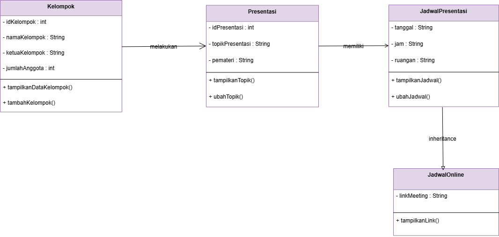
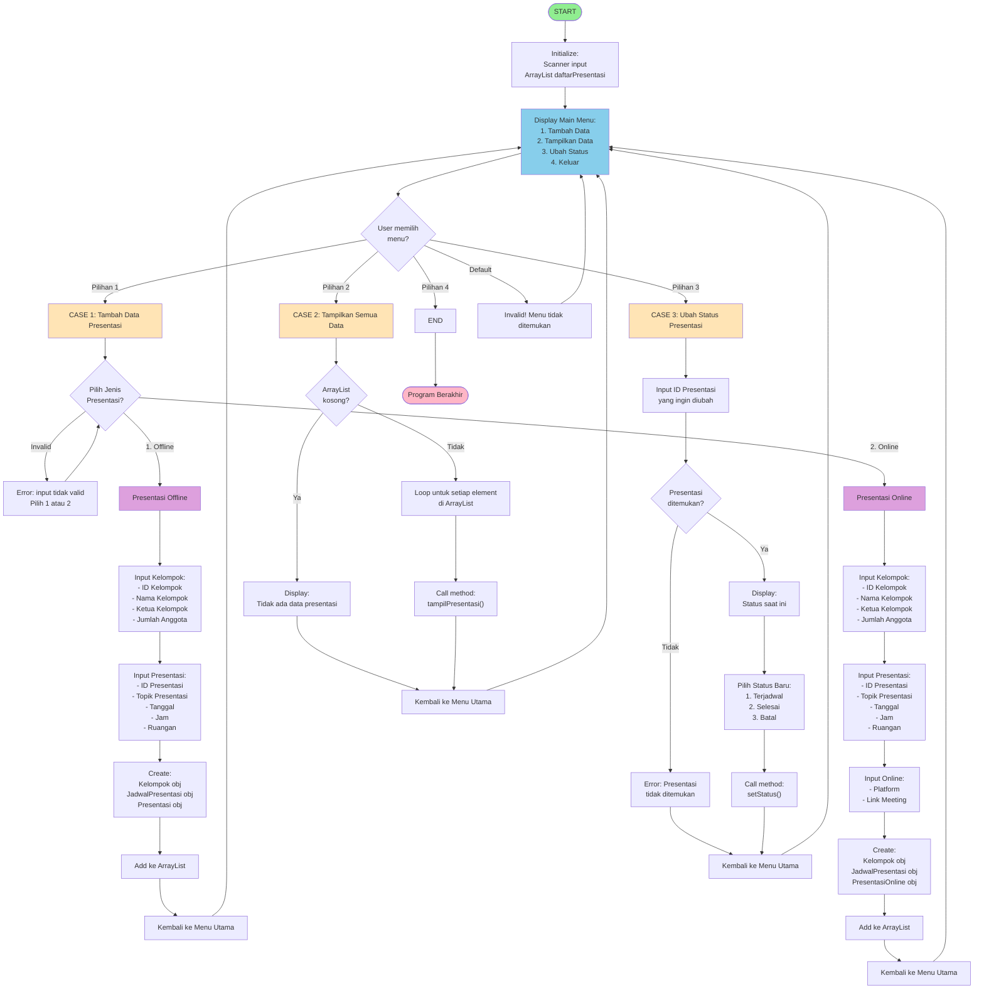

## BAGIAN 1 – ANALISIS SISTEM

## Class Overview

| Class | Atribut | Method |
| :--- | :--- | :--- |
| **Kelompok** | IdKelompok, namaKelompok, ketuaKelompok, jumlahAnggota | tampilkanDataKelompok(), tambahKelompok() |
| **Presentasi** | idPresentasi, topikPresentasi, pemateri | tampilkanTopik(), ubahTopik() |
| **Jadwal presentasi** | Tanggal, jam, ruangan | tampilkanJadwal(), ubahJadwal() |
| **Jadwal online** (inheritance) | linkMeeting | tampilkanLink() |

---

### Hubungan Antar Class
Dalam program yang saya buat, terdapat beberapa class yaitu `Kelompok`, `Presentasi`, `JadwalPresentasi`, dan `JadwalOnline`. Masing-masing class saling berhubungan untuk membentuk satu sistem pengelolaan jadwal presentasi.

### 1. Hubungan Kelompok dengan Presentasi
Class `Kelompok` berhubungan dengan class `Presentasi` karena setiap presentasi pasti dilakukan oleh sebuah kelompok. Di dalam class `Presentasi`, terdapat object dari class `Kelompok` yang digunakan untuk menyimpan data kelompok yang melakukan presentasi.

### 2. Hubungan Presentasi dengan JadwalPresentasi
Class `Presentasi` berhubungan dengan `JadwalPresentasi` karena setiap presentasi pasti memiliki jadwal pelaksanaan. Oleh karena itu, di dalam class `Presentasi` juga terdapat object dari `JadwalPresentasi` untuk menyimpan informasi waktu dan tempat presentasi.

### 3. Hubungan JadwalOnline dengan JadwalPresentasi (inheritance)
Class `JadwalOnline` merupakan turunan dari `JadwalPresentasi`. Artinya, `JadwalOnline` mewarisi semua atribut dan method dari `JadwalPresentasi`, seperti tanggal dan jam, tetapi menambahkan atribut baru yaitu link meeting. Hal ini digunakan untuk membedakan jadwal presentasi online dan offline.

---

## BAGIAN 2 – DESAIN CLASS DIAGRAM

---

## BAGIAN 3 — IMPLEMENTASI PROGRAM

### 1. Deskripsi Program
Sistem Jadwal Presentasi Kelompok adalah sebuah aplikasi berbasis Object-Oriented Programming (OOP) yang dirancang untuk mengelola dan mengorganisir data presentasi akademik. Program ini memfasilitasi pencatatan informasi kelompok, topik presentasi, serta jadwal pelaksanaan presentasi (tanggal, jam, dan ruangan) dalam satu sistem terpadu.

Aplikasi ini menggunakan pola modular design dengan pemisahan tanggung jawab (separation of concerns) untuk meningkatkan maintainability dan scalability. Data disimpan secara dinamis menggunakan struktur ArrayList, memungkinkan operasi CRUD (Create, Read) yang fleksibel.

### 2. Fitur Utama Sistem
| # | Fitur | Deskripsi |
|---|-------|-----------|
| **1** | Tambah Data Presentasi | Memungkinkan user menginput data kelompok, topik, dan jadwal presentasi |
| **2** | Tampilkan Data Presentasi | Menampilkan daftar lengkap presentasi dengan semua detail kelompok dan jadwal |
| **3** | Penyimpanan Data Dinamis | Menggunakan `ArrayList` untuk menyimpan multiple presentations |
| **4** | Validasi Menu | Sistem menu berbasis switch-case dengan error handling |
| **5** | Data Aggregation | Menggabungkan informasi kelompok, jadwal, dan presentasi dalam satu view |
| **6** | Pemeriksaan Data Kosong | Pengecekan ArrayList sebelum menampilkan data |

### 3. Alur Eksekusi Program

---

### BAGIAN 4 — ANALISIS KONSEP PBO

### 1. Jelaskan dimana konsep class dan object diterapkan dalam program Anda.
Dalam program yang saya buat, konsep class digunakan untuk membagi system menjadi beberapa bagian, yaitu Kelompok, Presentasi, JadwalPresentasi, dan JadwalOnline. Class menjadi cetakan/template untuk menyimpan data seperti data kelompok, topik dan jadwal. Saat user memilih menu tambah data, program akan membuat object dari class tersebut, misalnya object kelompok dan presentasi, lalu menyimpannya kedalam arraylist. Singkatnya object dibuat saat user menginput data dan data yang telah dibuat disimpan dalam ArrayList.

### 2. Jelaskan bagaimana program Anda menerapkan enkapsulasi.
Dalam program yang saya buat, enkapsulasi diterapkan dengan cara setiap class memiliki atribut dan method sendiri. Misalnya, data kelompok tidak langsung bisa ditampilkan secara langsung, tetapi melalui method `tampilkanDataKelompok()`. Begitu juga dengan yang lainnya mereka memiliki method masing-masing untuk menampilkan data.

### 3. Mengapa pendekatan PBO lebih baik dibandingkan pendekatan prosedural pada sistem yang Anda buat?
Menurut saya untuk program ini lebih cocok menggunakan PBO dikarenakan system terdiri dari beberapa bagian yang saling berhubungan, seperti kelompok, presentasi, dan jadwal. Dengan menggunakan PBO, setiap bagian dipisah kedalam class masing-masing sehingga program menjadi lebih rapi dan mudah untuk dikembangkan kedepannya. Selain itu didalam program ini juga terdapat inheritance pada `JadwalOnline` yang mewarisi `JadwalPresentasi`, sehingga tidak perlu menulis ulang kode yang sama.

---

## BAGIAN 5 — REFLEKSI

### 1. Bagian yang paling sulit dalam mengerjakan tugas ini
Bagian yang paling sulit dalam membuat program ini adalah saat menghubungkan data antar bagian program. Misalnya menghubungkan data kelompok, topik presentasi, dan jadwal agar jadi satu informasi yang utuh. Selain itu juga saya kesulitan mencari inheritance atau pewarisan untuk jadwal presentasi.

### 2. Hal baru yang Anda pelajari tentang konsep PBO
Hal baru yang dapat saya pelajari adalah saya belajar bahwa program bisa dibuat lebih rapi dan dibagi menjadi beberapa bagian sesuai fungsinya. Saya juga belajar bagaimana cara menyimpan banyak data sekaligus menggunakan `ArrayList`, serta makin memahami konsep enkapsulasi dan inheritance.

### 3. Jika sistem ini dikembangkan lebih lanjut, fitur apa yang akan ditambahkan?
Jika dikembangkan lagi, saya ingin menambahkan fitur seperti edit data, hapus data, dan status presentasi (sudah atau belum). Dengan begitu program akan lebih lengkap dan mudah digunakan.
